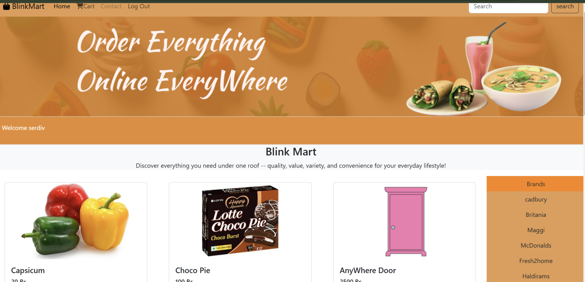
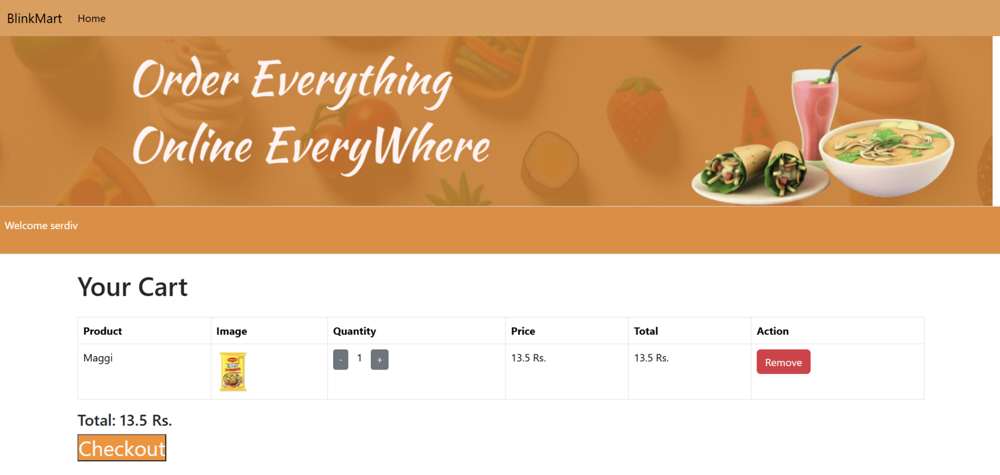
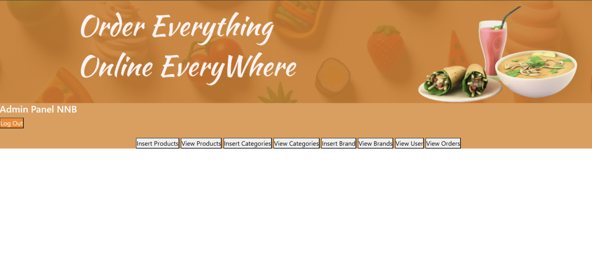
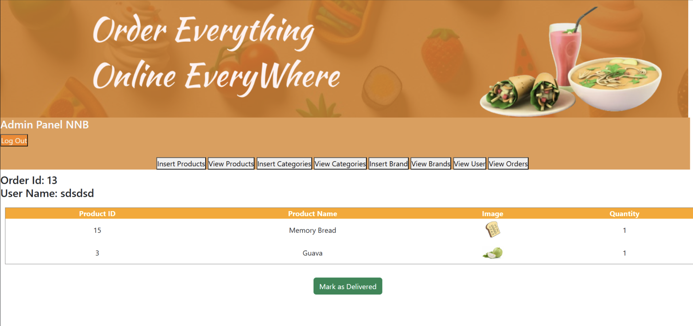

# BlinkMart - E-Commerce Website

## Overview

BlinkMart is an e-commerce web application designed to deliver a seamless shopping experience to customers and efficient management tools for administrators. The platform allows users to browse and purchase products online, while providing administrators with functionalities to manage inventory, orders, and users.


## Features

### User Features

- **User Registration and Login:** Secure authentication for users to access their accounts.
- **Product Browsing:** Explore a catalog of products with images, descriptions, and prices.
- **Cart Management:** Add, update, and remove items dynamically in the shopping cart.
- **Order Placement:** Place orders and track them in real-time.

### Admin Features

- **Product Management:** Add, update, and delete products, including details like title, description, price, and images.
- **Order Management:** View and update order statuses, including marking orders as delivered.
- **User Management:** View and manage registered users.


## Technology Stack

### Frontend

- **HTML, CSS, JavaScript:** For structuring and styling the user interface.
- **Bootstrap:** Responsive design and consistent theme.
- **FontAwesome:** Icons for enhanced visual appeal.

### Backend

- **PHP:** Server-side scripting for dynamic content generation and business logic.
- **AJAX:** Real-time updates without page reloads.

### Database

- **MySQL:** Efficient data storage and retrieval.

### Tools

- **XAMPP:** Local server and MySQL database.
- **VS Code/Sublime Text:** Code editors for development.
- **Browsers:** Compatible with Chrome, Firefox, Edge, and Safari.


## System Requirements

### Software

- Operating System: Windows/macOS
- Web Server: Apache (XAMPP) or Nginx
- Programming Languages: PHP, HTML, CSS, JavaScript
- Frameworks/Libraries: Bootstrap, FontAwesome

### Hardware

- Development Machine: Standard laptop or desktop with internet access.


## Database Design

### Tables

- **Users:** Stores user information (user\_id, username, email, password).
- **Products:** Details about products (product\_id, title, description, price, image).
- **Orders:** Tracks user orders (order\_id, user\_id, order\_date, status).
- **OrderItems:** Links products to orders (order\_item\_id, order\_id, product\_id, quantity).

### Relationships

- **One-to-Many:**
  - A user can place multiple orders.
  - An order can include multiple products.
- **Many-to-Many:**
  - Products can appear in multiple orders via `OrderItems`.


## Installation Guide

1. **Clone the Repository:**
   ```bash
   git clone https://github.com/your-username/blinkmart.git
   ```
2. **Setup XAMPP:**
   - Start Apache and MySQL services.
   - Import the `blinkmart.sql`  file in database folder into your MySQL database.
3. **Configure Database:**
   - Update database credentials or rename your database to blinkmart
4. **Launch Application:**
   - Open the application in your browser (e.g., [http://localhost/blinkmart](http://localhost/blinkmart)).
   - start the project with localhost/blinkmart/login.php

---
Login Page 

Home Page 

Cart 

Admin

Admin - order Detail
